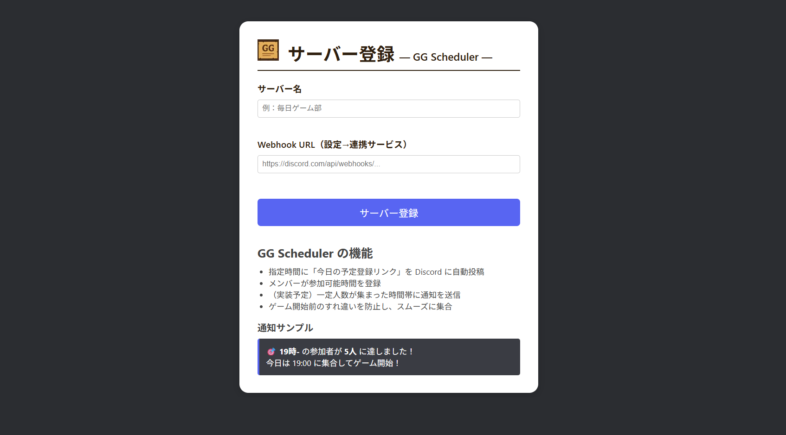
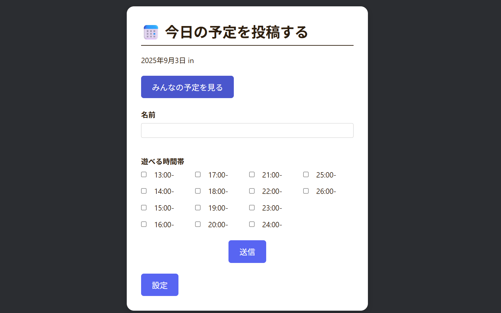
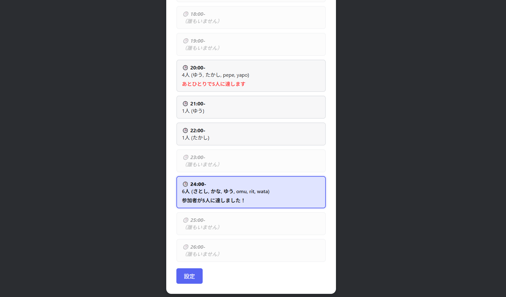

# GG_Scheduler

本アプリは、ゲーマーの方々がコミュニティ内で毎日のゲームプレイスケジュールを共有することで、  
日々のゲームライフの利便性を向上させることを目的としたアプリです。  

**No Game, No Life, No Schedule!**

## 使用技術

- React
- Next.js
- Prisma
- PostgreSQL（Renderでホスト）
- Discord Webhook 通知（Renderで実行）
- Vercel（フロントエンドのホスティング）

## 機能

- Discordサーバの登録（Webhook URL）
- スケジュールの追加・削除・変更
- スケジュールの共有・可視化
- 12時にDiscordに自動通知送信

## 使い方

1. 本アプリを導入したいDiscordサーバの**Webhook URL**を以下のURLから登録します
 [https://gg-scheduler.vercel.app/register](https://gg-scheduler.vercel.app/register)

3. Webhookの取得方法：  
   `Discordのサーバー設定 → アプリ → 連携サービス → ウェブフック → 新しいウェブフック → URLをコピー`

4. 指定日時になると、**スケジュール登録用URL**がDiscordに自動で送信されます。

5. サーバーメンバーが各自のスケジュールを登録・共有できます。

## 運用経験

- 自分の入っている数十人規模のゲームコミュニティでの使用

## アプリ画面

